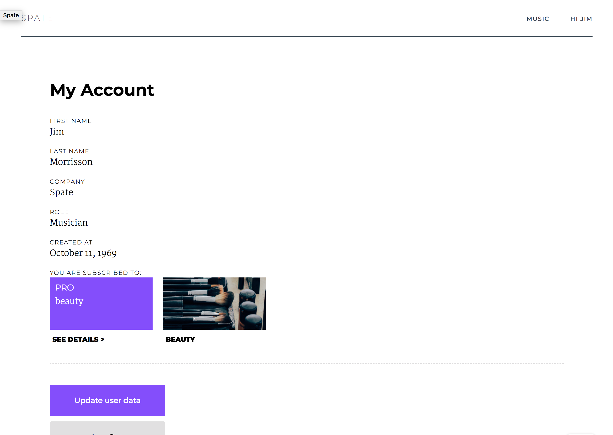

# Front End Engineering Exercise

## Overview

In this exercise, we'll ask you to build a pretty conventional 'My Account' view. The page will display a series of data fields related to the user, and allow to edit them.

The end result should be styled. It could be made to look like the following image, but feel free to improve it visually or go a different route. We will also take into account a certain attention to design.



## Requirements

There are many ways you could go about building a view like this, and we'll keep it moderately simple. The requirements are:

* Build a simple 'My Account' page.
* Use React to do so, and feel free to adjust the tooling the way you think best suits you.
* Break it down in different types of components as you see fit.
* The page muse load and fetch the user data from the file `assets/data/account.json`. The user information will be filled with data from `account.json`.
* The page should contain a header and a footer, which may contain some of the data from the loaded file.
* Add an `Edit User Data` button, which allows to edit any piece of information in the Account. For the purpose of this exercise,
allow to Save the edited information in the browser.

## Getting started

The project is prepared for you to start without having to worry about tooling and setting up the project. Once you've cloned the project, install the dependencies by doing:

```
npm install
```

Once everything is in, you should be able to start the development server by doing `npm start` and open [http://localhost:8080/](http://localhost:8080/)


To build code to static files run `npm run build` and compiled code is going to be in `/dest` folder

To run tests run `npm test`
